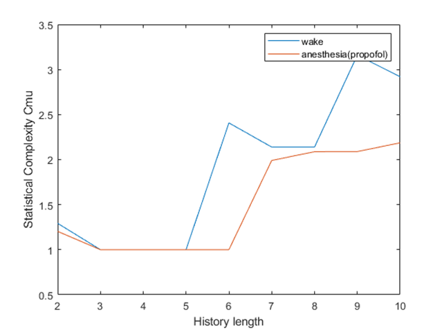
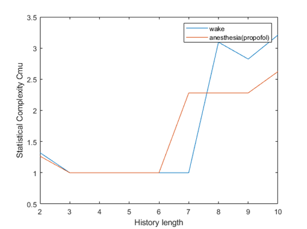
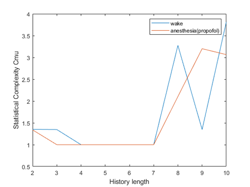

# Epsilon Machine and Degree of Consciousness 

Feb 2020 @[tLab](https://sites.google.com/monash.edu/tlab/home) under the supervision of Naotsugu Tsuchiya, Thomas Andrillon and Angus Leung. 

## Introduction 

CSSR algorithm can be used to infer a minimal-transition machine (as known as epsilon machine) from a time series. 

The statistical complexity of the epsilon machine can be an useful metric to measure the degree of consciousness. The related application has been done by Roberto N. Muñoz, his work in tLab can be viewed here https://doi.org/10.1103/PhysRevResearch.2.023219 

The resulting script of this project is [CSSR-Matlab](https://github.com/randoruf/CSSR-Matlab), which is a wrapper of CSSR. It should work across any platform now if you have Matlab. If you still want to use the original CSSR on Windows, download minGW may help. 

## Objective

Apply the similar framework from Roberto's paper to wake and anaesthesia datasets. 

This method of ***measuring the degree of consciousness*** can be applied to vegetative state diagnosis or [anesthesiology](https://www.youtube.com/watch?v=K2dMqs7GfuI) to avoid [accidental awareness during anaesthesia](https://www.bbc.com/news/magazine-38733131) without the need of observing patients' responses to the external stimulus.  

 

## Method 

- Preprocessing EEG
	- Montage and Sensor Layout by MNE ([plot EEG electrode layout](https://mne.tools/stable/auto_tutorials/intro/plot_40_sensor_locations.html))
	- Re-referencing : **Mastoid Reference**
		- Usual reference technique is Bipolar Spatial Reference (arbitrary reference) or **Mastoid Reference**
		- A more sophisticated technique is Laplacian Spatial Reference (small and large Laplacian, the small Laplacian is an improved version of Bipolar reference), details can be viewed in [Chapter 2 - EEG-Based Brain-Computer Interfacing (BCI)](https://www.sciencedirect.com/science/article/pii/B9780128146873000028) in *EEG-Based Brain-Computer Interfaces: Cognitive Analysis and Control Applications* 
		- Implementations: [MNE plot_csd](https://mne.tools/stable/auto_examples/preprocessing/plot_eeg_csd.html) or [CSD Toolbox](https://psychophysiology.cpmc.columbia.edu/software/csdtoolbox/) in Matlab  
	- Noise Filtering: **forward-backward Butterworth IIR filter of order 5** by [FieldTrip](https://mne.tools/stable/auto_tutorials/discussions/plot_background_filtering.html)
		- The frequencies of brainwave usually range from 0.5 to 100+Hz. A single at a very high frequency is probably an artifact.  
		- Power line noise: 50 Hz and its harmonics. see [MNE tutorial](https://mne.tools/stable/auto_tutorials/preprocessing/plot_10_preprocessing_overview.html)
- Channel Selection: **central electrode** 
	- Only one channel is used. 
- Time Series to Symbolic Vector: **difference split** 
	- median split: if a value is higher than the median value, denote as 1. If lower, denote as 0 
	- difference split: if v(t) - v(t-1) is positive, denote as  1, otherwise denote as 0. 
	- top split: divide the distribution of EEG voltage values into serval sub-regions. Each region can be represented by an integer. Note that when n = 2, it is median split. This is implemented in [CSSR-Matlab](https://github.com/randoruf/CSSR-Matlab/blob/master/discretiser/multi_level_discretiser.m). 
	-  symbolic transformation:  a method inspired by Permutation Entropy. mentioned in [*Information Sharing in the Brain Indexes Consciousness in Noncommunicative Patients*](https://doi.org/10.1016/j.cub.2013.07.075). Be careful to potential aliasing as sampling is subject to Nyquist sampling theorem. 
- use CSSR to compute the **statistical complexity** for each epoch. 
	- Epoching is very popular technique in neural science and speech recognition. The behind theory is [Short-time Fourier transform](https://en.wikipedia.org/wiki/Short-time_Fourier_transform), which will guarantee the [stationary assumption](https://en.wikipedia.org/wiki/Stationary_process). Note that CSSR is very sensitive to stationary assumption, 
	- Compute the stationary complexity for each epoch. 
		- As an epsilon machine is very similar to a deterministic finite state machine (DFA), we can use an epsilon machine to generate many different sequences. The basic idea is that if two epsilon machines can generate the set of same sequences with similar probabilities,  then two epsilon should be similar. To compare probability distributions of the set of same sequences, KL divergence can be used. Rate of KL divergence and other novel metrics purposed by Roberto N. Muñoz et.al. can be seen in his paper, great work from [tLab](https://sites.google.com/monash.edu/tlab/).
	- Choose parameters for CSSR
		- History Length ***L***
			- In our experiments,  CSSR is very sensitive to history length. History length should be close to the true order of the hidden Markov model. If the history length is too large, “blow-up” in number of causal state may occur. 
			- Suggestion: exploring the data from low *L* . See <https://github.com/stites/CSSR#4-some-suggestions-about-parameters>
		- Roberto's paper provides advice on choosing the significance level 
-  Compare the preliminary results with the original paper - *[The spectral exponent of the resting EEG indexes the presence of consciousness during unresponsiveness induced by propofol, xenon, and ketamine - PubMed (nih.gov)](https://pubmed.ncbi.nlm.nih.gov/30639334/)*  

## Conclusion 

It shows that if the history length is larger than 8, the distinction between wake and anaesthesia can be significant. The results agree with the original paper overall (xenon, propofol can suppress consciousness while ketamine not). 

| Propofol                                                     | Xenon                                                   | Ketamine                                                |
| ------------------------------------------------------------ | ------------------------------------------------------- | ------------------------------------------------------- |
|  |  |  |

In the future, 

- Both the complexity and asymmetry of a process can be measured (statistical complexity, causal irreversibility, crypticity KL divergence) .  Details in Roberto's paper 
- The idea from Short-time Fourier transform can be used to guarantee stationary assumption in a short-time process. 
- Other discretization techniques like top and symbolic transformation can be used. Moreover, Outlier problems have not been considered yet (EEG is usually very noisy). 
- As CSSR-Matlab now can work in Matlab, it is easy to integrate the CSSR into [HCTSA](https://github.com/benfulcher/hctsa). It can be used to compare epsilon machine with other existing promising feature, see https://hctsa-users.gitbook.io/hctsa-manual/analyzing_visualizing/feature-comparison for details. 

