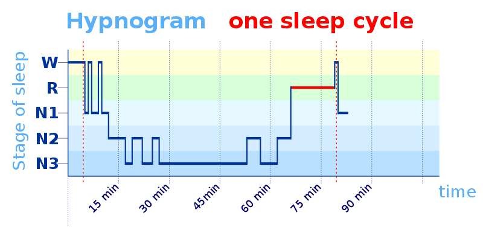
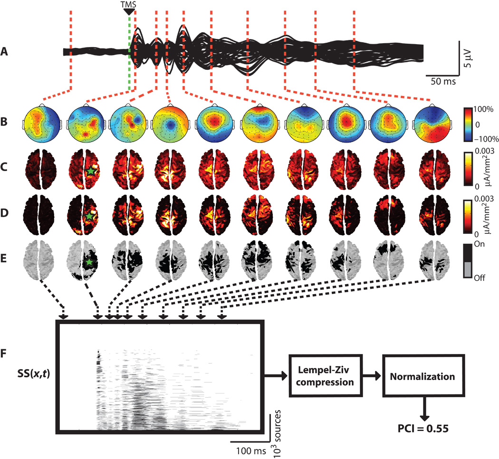
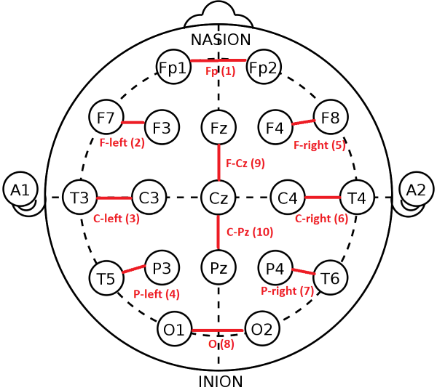
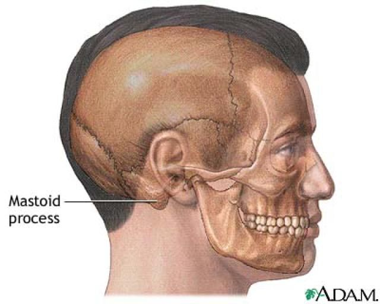
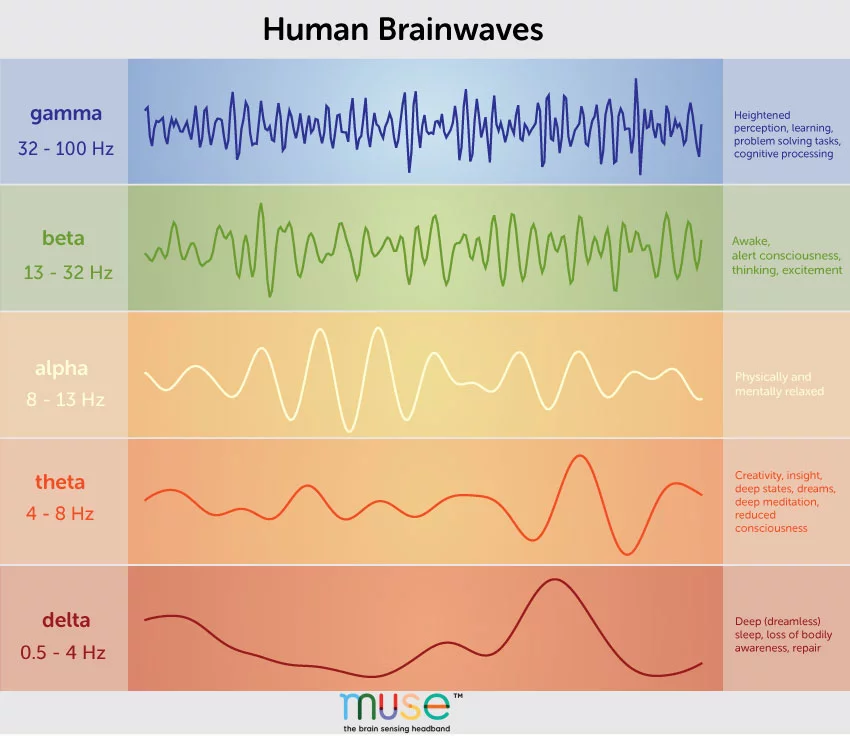
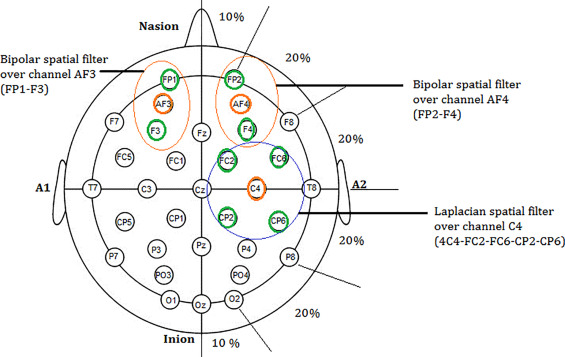
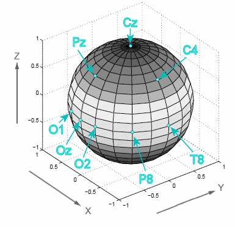
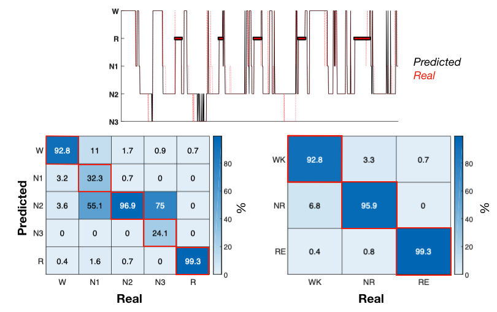

[TOC]

---

## 0. Background 

### 0.1 Consciousness 

* Integrated Information Theory (IIT) 

  * to measure the level of consciousness of an object (alive or mechanical, or other types).
  *  https://www.jiqizhixin.com/articles/2015-08-25-5 
  *  https://www.guokr.com/article/438288/ 
  *  http://tech.sina.com.cn/d/i/2016-03-23/doc-ifxqnski7861996.shtml 
  *  https://en.wikipedia.org/wiki/Integrated_information_theory 
  *  http://theconversation.com/what-makes-us-conscious-50011 

* Distinguished states of conscious arousal using statistical complexity  

  *  https://arxiv.org/pdf/1905.13173.pdf 

* Thomas's Human sleep 

  *  https://pdfs.semanticscholar.org/6700/5e65777d48a9f59e40980f4aa69b43e1dce3.pdf?_ga=2.189889262.499933856.1574682098-1950134925.1574682098 

* Human Sleep 

  *  https://www.msdmanuals.com/home/quick-facts-brain,-spinal-cord,-and-nerve-disorders/diagnosis-of-brain,-spinal-cord,-and-nerve-disorders/electroencephalography-eeg?query=EEG 
  *  scalp 头皮： the skin on the top of a person's head where hair grows. 
  *  https://www.runtastic.com/blog/zh/sleep-cycle-calculator/ 
  * An ideal sleep (6-8 hours) contains 5-6 sleep cycles. 
    * In each sleep cycles, 5 stages 
    * **Hypnogram**
      * hypno gram , hypnos (hip nes ) is the god of sleep. 
      *  https://www.msdmanuals.com/home/brain,-spinal-cord,-and-nerve-disorders/sleep-disorders/overview-of-sleep#v8305038 
    *  
    * **NREM** 
      * non-rapid eye movement sleep 
      * brain resting 
      * body active 
    * **REM** 
      * rapid eye movement sleep 
      * brain active 
      * body resting 

  

---

## 1. Conscious arousal and human sleep

### 1.1 Distinguishing states of conscious arousal using statistical complexity

* To distinguish levels of conscious arousal
  * Why to distinguish conscious arousal 
    * For a doctor to diagnose the patients who suffered traumatic brain injury.  
  * **Perturbational Complexity Index** (PCI)
    *  https://www.wired.com/2013/08/defining-consciousness/ 
    * uses the **brain’s electrical response** to magnetic stimulation to judge a person’s awareness, reducing it to a numerical score they call an index of consciousness.  
      * reduce 在 FIT2102, FIT3143都学过了， 把一堆变量缩小到一个。 
      *  “You’re kind of banging on the brain and listening to the echo,” says Anil Seth 敲击大脑， 然后听回音。
    *  Perturbational complexity index (PCI) looks at the brain’s response to transcranial magnetic stimulation (TMS)
    * Massimini and his colleagues **record the brain’s “echo” with electroencephalography**, a measure of electrical activity, and then **turn that data into a numerical score between 0 and 1**.  
    * If two distant groups of neurons are active, but their activity is synchronized, the PCI equation compresses them, meaning they contribute less to the overall score. “The less we can compress the pattern, the more information is in it,” Massimini explains.  （信息论：用熵即无序性来描述数据的离散程度。 如果两组神经元同时活动，可被压缩， 压缩暗示有序）
      * There was no overlap in scores between conscious and unconscious subjects, suggesting a potentially useful cutoff or threshold for consciousness, somewhere between the highest unconscious score (0.31) and the lowest conscious score (0.44).  有意识和无意识(通过麻醉 anesthesia) 的数据之间没有重叠， 意味着(suggesting) 有一个阈值(threshold) 来区分意识。
      * PCI is a first step towards **absolute scale** for consciousness. 
      * Issues???读不懂
    * 
  * 
  * 

* **Statistical complexity** (and epsilon machine)
  
  * it is denoted as $$C_\mu$$. 
  
  * **how much information you need to know** to predict based on a given history (given known causal state, how well can you model the data) Shannon Entropy. 
  
  * serves as a summary for the whole e-machine plot, and possibly a measure of consciousness..
  
  * [Epsilon-machines and Information-theory tutorials.pdf](Epsilon-machines and Information-theory tutorials.pdf)  , (how to compute the probability? -- statistics !!)
  
  * To construct a **Epsilon-machine**, you need to set up two parameters first, $$\lambda $$ and $$\sigma $$
  
    * $$\lambda $$ is the size of the history length 
  
    * $$\sigma $$ is significance level, which indicates the error that a sequence is mistakenly split off to a new casual state. (how the casual states are merged.)
  
      * Obviously, as $$\sigma $$ increases, there will be more new causal states in a process. 
  
    * Note that computational time of the epsilon machine grow exponentially with $$\lambda$$ (size of the history length) , as $$\cal{O}(|\cal{A}^{2\lambda +1}|)$$
  
    * Hence, to reduce the computational time, need to set a limit of $$\lambda \leq L(N)$$
      $$
      L(N) = \frac{\log_2N}{\log_2|\mathcal{A}|}
      $$
  
      Where $$|\mathcal{A}|$$ is the size of alphabet $$\cal{A}$$ , $$N$$ is the size of input data. 
  
  * **Statistical complexity of a process** 
  
    * The output of CSSR algorithm 
      * A graph that 
        * Vertices $$V$$ : a set of causal states 
        * directed Edges $$E$$ : rules for transitioning from one state to another
      * A  graph of Markov Chain 
    * Use **Shannon Entropy** theory to **measure the complexity of the e-machine.** 
      * *The **complexity** here I really mean the **complexity of e-machine**.* 真的是图的复杂度。 
        * If e-machine has many vertices and edges, then it is complicated/complex. 
        * No much transitions in e-machine, then the graph is simple. (hence Entropy is approximated to 0). 
        * Use the square brackets to indicates the **discrete time series**. 

$$
C_\mu := H[s] = -\sum_iP(S_i)\log P(S_i)
$$

---

* **Markovian** dynamics 
  * the future evolution of a neural system is determined statistically by its present state. (namely $$S_n = S_{n-1}$$)

---

---

### 1.2 Human  Sleep 

* The EEG measures **potential differences** between electrode positions on the scalp.
  * for example, the potential of $$Fp1$$ is referenced to $$A1$$, then $$ V_{FP1}= U_{FP1} - U_{A1}$$ as mastoids are chosen as reference (such as **ground**). A1 and A2 are reference point. (can be thought of as **ground**)
*  https://www.youtube.com/watch?v=AcW97nMLGEs 

* **Hertz** (Hz) means *"samples per second"* 
  * 5836000/200/60/60 = 8.1 , 8 hours sleep recording.
* The *EEG* can be monitored with either a ***bipolar* montage** or a **referential** one 
  *  https://www.medicine.mcgill.ca/physio/vlab/biomed_signals/eeg_n.htm 
* EEG channels were first **referenced to the average mastoids**.
  *  
  *  Often, the **mastoids are chosen as reference electrodes**, because while being close in distance to the electrodes, they record less signal from the brain.  
  *   https://blricrex.hypotheses.org/ressources/eeg/pre-processing-for-erps/re-referencing-eeg-data 
*  To find the index of a channel  `match_str(D.chanlabels,'Electrode name')` 

### 1.2.1 Brain Waves 

* as well as called  **neural oscillations** / **Brainwaves** 
* can be used to determine the stage of a sleep cycle 
  * $$\gamma$$ gamma (above 30Hz , 38 ~ 42 Hz)
  * $$\beta$$ beta (14-30 Hz) 
  * $$\alpha$$ alpha (8-14 Hz) 
  * $$\theta$$ theta (4-8Hz)
  * $$\delta$$ delta (4 Hz)

## 3. Re-Referencing 

* Averaging mastoid referencing 
  * use the mean of the potentials of two mastoids 
* Bipolar referencing 
  * set pairs of electrodes arbitrarily

### 3.1 Spherical Coordinate

---

## 4. Confusion Matrix

* 

---

## 5. ICA Decomposition 

### 5.1 Cocktail party effect 

The **cocktail party effect** is the phenomenon of the brain's ability to **focus one's auditory attention (an effect of selective attention in the brain) on a particular stimulus while filtering out a range of other stimul**i, as when a partygoer can focus on a single conversation in a noisy room.[[1\]](https://en.wikipedia.org/wiki/Cocktail_party_effect#cite_note-:0-1)[[2\]](https://en.wikipedia.org/wiki/Cocktail_party_effect#cite_note-Bronkhorst_2000-2)[[3\]](https://en.wikipedia.org/wiki/Cocktail_party_effect#cite_note-Shinn-Cunningham_2008-3) 

鸡尾酒会效应是指人的一种听力选择能力，在这种情况下，注意力集中在某一个人的谈话之中而忽略背景中其他的对话或噪音。 

### 5.2 Independent Component Analysis (ICA)

Independent component analysis attempts to decompose a multivariate signal into independent non-Gaussian signals from multiple different sources. 

* Sound is typically is composed of numerical addition of signals from several sources. 
  * Blind ICA performs very well when the statistical independence assumption is correct.  

## 7. Pre-processing 

**Background** : 

- Knowing **EEG** and **MEG** 
  - Electro-encephalography (EEG) and magneto-encephalography (MEG) are functional imaging methods used to measure brain activity directly and non-invasively (from outside the head). 
  - EEG detects synchronised electrical activity of large groups of [neurons](https://bigpictureeducation.com/glossary#term181), whereas MEG detects the tiny changes in magnetic fields that this electrical activity is associated with. 
- Knowing **EOG** 
  - 
- Knowing **EMG** 
  - 

