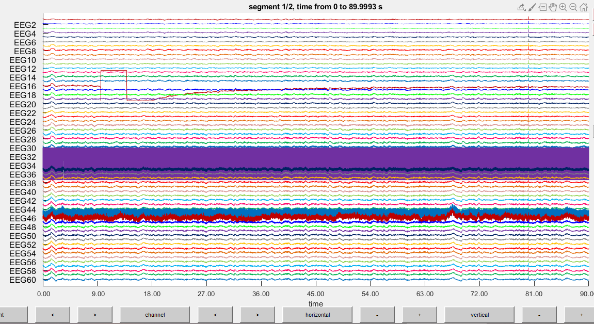
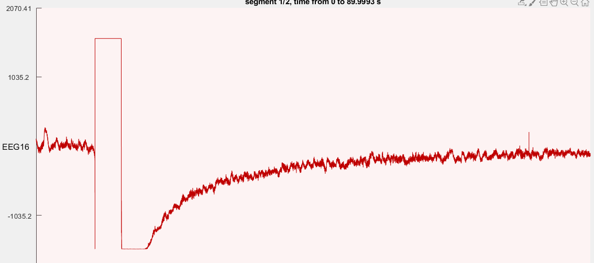
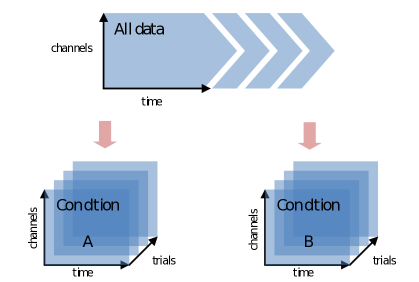
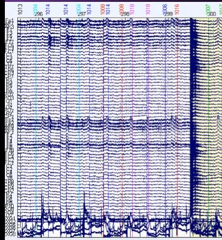

**Mike X Cohen's personal blog** 

* <http://sincxpress.com/>
* <https://www.youtube.com/channel/UCUR_LsXk7IYyueSnXcNextQ/featured>
* http://mikexcohen.com/lectures.html

Copyrights by Mike.


---

* TOC 
{:toc}
## 0. Overview of EEG Processing

Data pre-processing and cleaning https://www.youtube.com/playlist?list=PLn0OLiymPak2gDD-VDA90w9_iGDgOOb2o)

The difference between pre-processing and processing. 

- **Pre-processing** (Stage 1 and 2)
  - Time-consuming and not science (more like engineering). 
- **Processing** (Stage 3 and 4)
  - Hypothesis-driven 
  - Exploratory 

---

## 1. Data pre-processing and cleaning

**Why Pre-processing is important ?**

- What is **volume conduction** ?: https://www.youtube.com/watch?v=QW0C3LD3nbY 

> **Thomas Andrillon** : Given you will be analysing the noisiest data from the eM group **(scalp EEG data)** the pre-processing will be indeed key.

> **Mike X Cohen** : For connectivity analyses with electrophysiology data, yes you always need to be concerned about **potential spurious results or inflation by volume conduction**. Laplacian is one of the several methods for addressing this issue. 

**Note**: 

> Mike X Cohen said "ICA after CSD is valid, but then you couldn't apply the weights back to the raw voltage data. " 
>
> **CSD (namely Laplacian) is done at the end of the pre-processing pipeline.**

To be clear, the CSD attenuates low spatial frequencies, not necessarily the low temporal frequencies. 

**CSD and ICA are both linear spatial filters.** 

---

### 1.1 Import and Re-reference 

Basically about **1) trial-define, 2) combine EOG and EEG, 3) filtering , 4) visual artifact rejection**

#### 1.1.1 Import data 

You may want to import the data from your device or your own data format. Take **FieldTrip** as an example, 

* If common acquisition device, http://www.fieldtriptoolbox.org/reading_data/
* If not standard, http://www.fieldtriptoolbox.org/faq/how_can_i_import_my_own_dataformat/

After importing, the first thing you may want to see is how EEG/MEG looks like 

```matlab
cfg = [];
cfg.viewmode = 'vertical';
artfct       = ft_databrowser(cfg, data_eeg)
```

<details>
<summary>
<a class="btnfire small stroke"><em class="fas fa-chevron-circle-down"></em>&nbsp;&nbsp; First glance at EEG data</a>    
</summary>
 <p>This is just a very basic example. If you adjust the scale at the bottom and select a channel. You will easily find artifacts like this</p></details>


#### 1.1.2 And about re-referencing

Some re-referencing approaches 

* Best : mastoids or earlobes, or average (of all electrodes)
* Acceptable : nose, vertex, scalp electrode 
* Poor : Unilateral 
* Special : Laplacian 


#### 1.1.3 Filter 

It is recommended to minimize **slow drifts**, **DC offset** and AC (with its harmonics , e.g. 50 Hz, 100 Hz, 150 Hz....). (but not necessary).

- High-pass filter at 0.5 Hz 
- Notch filter at 50 Hz with its harmonics 
- (Low-pass filter at 60 Hz ? It depends. Ignore this if to conserve information as much as possible) 


#### 1.1.4 Epoching 

To cut the data into **epochs/segments**. 




#### 1.1.5 Linear Baseline-Correct 

Remove DC offset for ERPs, topomaps and **ICA**. 

* In ICA, the biggest components will be driven entirely by DC offsets. 


1.1.6 


### 2. Trial Rejection and Interpolation 

* Overview of artifact detection : https://mne.tools/dev/auto_tutorials/preprocessing/plot_10_preprocessing_overview.html#tut-artifact-overview
* Interpolate bad channels for MEG/EEG channels : https://mne.tools/dev/auto_examples/preprocessing/plot_interpolate_bad_channels.html
* Introduction: dealing with artifacts : http://www.fieldtriptoolbox.org/tutorial/artifacts/
* Visual artifact rejection : http://www.fieldtriptoolbox.org/tutorial/visual_artifact_rejection/
* Repairing artifacts with ICA : https://mne.tools/dev/auto_tutorials/preprocessing/plot_40_artifact_correction_ica.html#sphx-glr-auto-tutorials-preprocessing-plot-40-artifact-correction-ica-py

**Bad trial/channel rejection** is usually **manual**. 

* reject the **bad channels** (technique issues while collecting)
* reject the **bad trials** (a period when **all channels behave badly**, see blue thick line in the ) 
  * 

(But ignore the **blinks** and **muscle** movements, ICA and other filtering can remove them)

