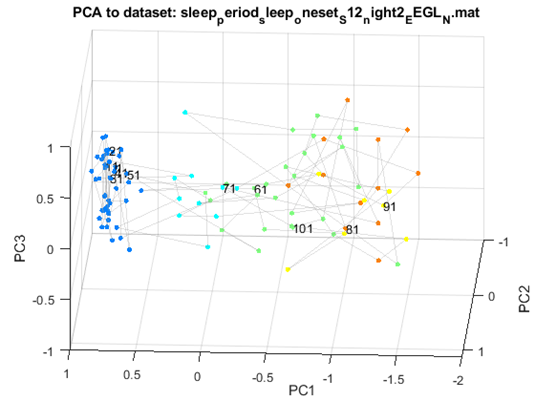
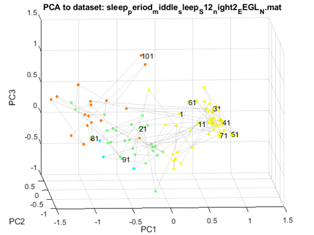
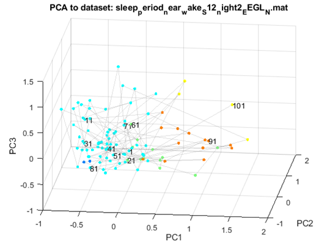
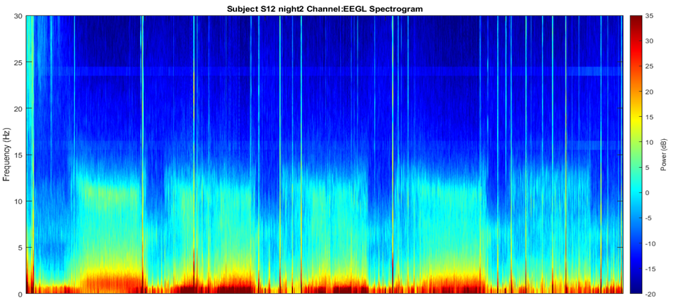
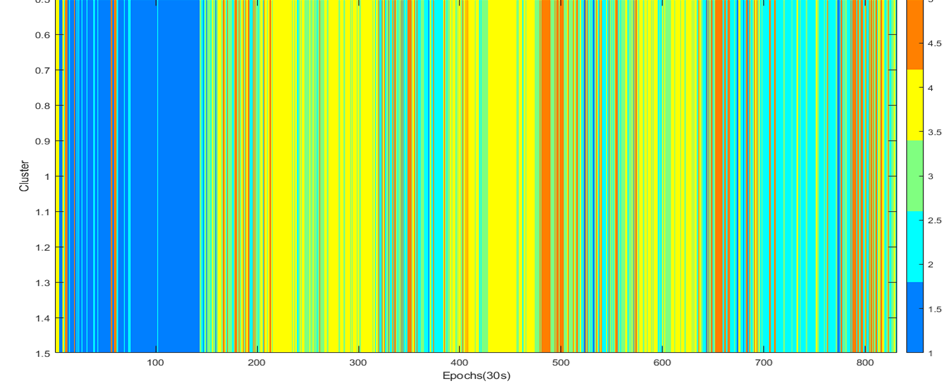

# Sleep Scoring by a Data-driven Method 

July 2020 @[tLab](https://sites.google.com/monash.edu/tlab/home) under the supervision of Naotsugu Tsuchiya, Thomas Andrillon and Angus Leung. 

## Introduction 

Use HCTSA and its subset catch22 for automated sleep stage scoring in a data-driven method. 

## Method 

- Fixed size epoch 
	- 10s, 30s....
- [HCTSA](https://github.com/benfulcher/hctsa) and [catch22](https://github.com/chlubba/catch22)
	- [Multi-taper Spectrogram](https://prerau.bwh.harvard.edu/multitaper/) (for comparisons)
- K-medoids Clustering 
- Principle Component Analysis (can be [Robust Component Analysis](https://www.youtube.com/watch?v=yDpz0PqULXQ) in the future)

## Result

In classical sleep scoring method, an epoch is usually fixed to 30 second (N1, N2, N3....). Each point in the following figures represent an epoch. It is clear that some clusters tend to appear in some sleep periods. 

### Sleep Periods - Sleep Onset 

### Sleep Periods - During sleep

### Sleep Periods - Near Wake

### Spectrogram and Catch22+K-medoids Clustering 

The comparison between the spectrogram and catch22.  

## Conclusion 

Cath22 can extract useful information from EEG time series. 

This simple method can be used for automated sleep scoring from a new point of view (other than spectrogram or RNN). 